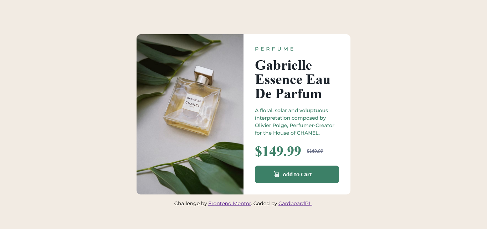

# Frontend Mentor - Product preview card component solution

This is a solution to the [Product preview card component challenge on Frontend Mentor](https://www.frontendmentor.io/challenges/product-preview-card-component-GO7UmttRfa). Frontend Mentor challenges help you improve your coding skills by building realistic projects. 

## Table of contents

- [Overview](#overview)
  - [The challenge](#the-challenge)
  - [Screenshot](#screenshot)
  - [Links](#links)
- [My process](#my-process)
  - [Built with](#built-with)
  - [What I learned](#what-i-learned)
  - [Continued development](#continued-development)
  - [Useful resources](#useful-resources)
- [Author](#author)

## Overview

### The challenge

Users should be able to:

- View the optimal layout depending on their device's screen size
- See hover and focus states for interactive elements

### Screenshot

### Links

- Solution URL: [GitHub Repo](https://github.com/CardboardPL/Frontend-Mentor-Product-preview-card-component)
- Live Site URL: [Add live site URL here](https://cardboardpl.github.io/Frontend-Mentor-Product-preview-card-component/)

## My process

### Built with

- Semantic HTML5 markup
- Flexbox
- Desktop-first workflow

### What I learned

I learned about the del tag and how it is used.

### Continued development

I plan to make this as an inspiration for my future projects

### Useful resources

- [W3Schools article about the del tag](https://www.w3schools.com/tags/tag_del.asp) - This helped me figure out on what tag to use on the original price.

## Author

- Frontend Mentor - [@CardboardPL](https://www.frontendmentor.io/profile/CardboardPL)
- Twitter - [@SirPLWasTaken](https://www.twitter.com/SirPLWasTaken)
